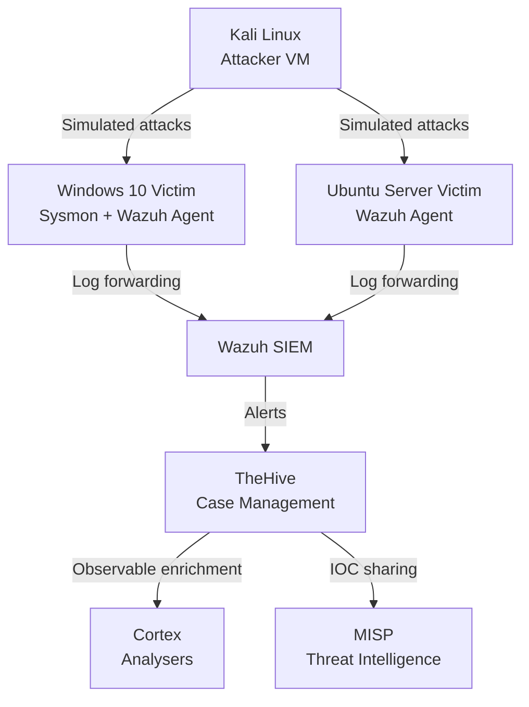

# IR Playbook Library - Incident Response for the Modern SOC

A hands-on incident response playbook library built from simulated attacks in an isolated homelab SOC environment. Every playbook is grounded in real lab evidence -- detection criteria reference actual Wazuh rule IDs, triage questions reflect what genuinely needed answering and known detection gaps are documented honestly.

---

## Architecture



---

## Technologies

| Component | Role | Version |
|-----------|------|---------|
| **Wazuh** | SIEM / XDR -- log ingestion, FIM, rule-based detection, alerting | 4.14 |
| **TheHive** | Case management -- incident tracking, observables, tasks | 5.6 |
| **Cortex** | Observable enrichment -- VirusTotal, AbuseIPDB, Shodan | 4.0 |
| **MISP** | Threat intelligence -- IOC storage and sharing | Latest |
| **Sysmon** | Deep Windows endpoint telemetry (SwiftOnSecurity config) | 15.2 |
| **VirtualBox** | Hypervisor -- isolated internal network | 7.1 |
| **Kali Linux** | Attacker VM -- Metasploit, msfvenom, netcat | Latest |

---

## Playbook Coverage

| Scenario | Severity | MITRE Techniques | ICO Notifiable | Status |
|----------|----------|-----------------|----------------|--------|
| [Phishing](playbooks/phishing/playbook.md) | High | T1566.001, T1204.002, T1078 | Conditional | In Progress |
| [Malware Outbreak](playbooks/malware-outbreak/playbook.md) | Critical | T1059, T1071, T1055, T1547 | Conditional | In Progress |
| [Ransomware](playbooks/ransomware/playbook.md) | Critical | T1486, T1490, T1489 | Yes | In Progress |
| [Lateral Movement](playbooks/lateral-movement/playbook.md) | Critical | T1021.002, T1550.002, T1078 | Conditional | In Progress |
| [Data Exfiltration](playbooks/data-exfiltration/playbook.md) | Critical | T1048, T1041, T1567 | Yes | In Progress |

> Status updates to Complete after each lab scenario is run and evidence collected.

---

## Project Phases

### Phase 1 - Lab Environment
Deployed attacker and victim VMs in an isolated VirtualBox internal network. Installed Sysmon on the Windows victim using the SwiftOnSecurity config and confirmed Wazuh agents reporting on both endpoints before running any scenarios.

### Phase 2 - Integrations
Connected all SOC stack components:
- **Wazuh → TheHive** -- alert forwarding for case creation
- **TheHive ↔ Cortex** -- observable enrichment within cases
- **TheHive ↔ MISP** -- bidirectional IOC sharing
- **Cortex analysers enabled:** VirusTotal, AbuseIPDB, Shodan, URLhaus

### Phase 3 - Attack Simulation
Ran each scenario on the victim VMs before writing the corresponding playbook. Tools and techniques used per scenario:

```
Phishing       → Malicious .hta / macro-enabled Word doc → Sysmon Event ID 1, 3
Malware        → Metasploit meterpreter reverse shell     → Sysmon Event ID 1, 3
Ransomware     → RanSim / Python file encryptor           → Wazuh FIM mass modification
Lateral Move   → Metasploit PSExec / pass-the-hash        → Event ID 4624, 7045
Exfiltration   → netcat large file transfer               → Sysmon Event ID 3
```

### Phase 4 - Detection and Triage
For each scenario, triaged the incident through TheHive: created cases, added observables and ran enrichment through Cortex. Documented Wazuh rule IDs, Sysmon events and Kibana queries used during investigation.

### Phase 5 - Playbook Authoring
Wrote each playbook based on what actually happened in the lab -- detection criteria, triage questions, decision trees, escalation paths, automation scripts and UK GDPR compliance checkpoints. Post-incident reports completed per scenario using the standard template.

---

## What Each Playbook Contains

Every playbook follows PICERL and NIST SP 800-61:

- **Detection criteria** -- Wazuh rule IDs and Sysmon event IDs that trigger the playbook
- **Triage questions** -- first five questions to answer within five minutes of alert
- **Decision tree** -- Mermaid diagram with branching containment logic
- **Escalation matrix** -- L1 → L2 → L3 → CISO triggers and handover requirements
- **PICERL phases** -- all six phases with actual commands at each step
- **Recovery validation checklist** -- explicit sign-off criteria before returning to production
- **UK GDPR / ICO tripwires** -- 72-hour notification obligations flagged per scenario
- **Known detection gaps** -- what the stack misses and what would close each gap
- **Automation scripts** -- shell and PowerShell for containment, evidence collection, hunting
- **IOC template** -- pre-formatted for TheHive and MISP ingestion
- **Real-world reference** -- UK-relevant incident tied to each scenario

---

## Repository Structure

```
ir-playbooks/
├── README.md
├── playbooks/
│   ├── phishing/
│   │   ├── playbook.md
│   │   └── automation/
│   │       └── collect-evidence.sh
│   ├── malware-outbreak/
│   │   ├── playbook.md
│   │   └── automation/
│   │       ├── volatile-collection.ps1
│   │       └── isolate-host.sh
│   ├── ransomware/
│   │   ├── playbook.md
│   │   └── automation/
│   │       ├── isolate-host.sh
│   │       └── hunt-encrypted-files.ps1
│   ├── lateral-movement/
│   │   ├── playbook.md
│   │   └── automation/
│   │       └── hunt-logon-type3.ps1
│   └── data-exfiltration/
│       ├── playbook.md
│       └── automation/
│           └── hunt-staging-files.ps1
├── templates/
│   ├── playbook-template.md
│   ├── post-incident-report-template.md
│   └── escalation-matrix-template.md
├── mitre-mapping/
│   ├── navigator-layer.json
│   └── navigator-layer.png
└── metrics/
    └── scenario-results.md
```

---

## Screenshots

| Screenshot | Description |
|------------|-------------|
| `wazuh-fim-alert.png` | FIM mass modification alert firing during ransomware simulation |
| `thehive-case-phishing.png` | TheHive case with observables and Cortex enrichment |
| `cortex-virustotal-result.png` | VirusTotal analyser result on malware hash |
| `misp-ioc-event.png` | IOCs added to MISP following lateral movement scenario |
| `sysmon-process-tree.png` | Sysmon Event ID 1 process tree showing malware parent chain |
| `wazuh-logon-type3.png` | Wazuh alert on Event ID 4624 Logon Type 3 during lateral movement |
| `mitre-navigator-layer.png` | ATT&CK navigator layer showing full technique coverage |

> All screenshots in [`docs/screenshots/`](docs/screenshots/)

---

## Detection Gaps

This stack has real gaps, documented honestly in each playbook. The headline ones:

- **Raw TCP exfiltration** is not detected by Wazuh alone -- Zeek `conn.log` large transfer alerting would close this gap
- **Encrypted C2 over HTTPS** blends into normal web traffic -- SSL inspection or Zeek JA3 fingerprinting required
- **Phishing email delivery** is not visible in Wazuh without mail gateway integration
- **Pass-the-hash with legitimate admin accounts** requires behavioural baselining to separate from normal admin activity

---

## Metrics

*Populated after lab runs.*

| Scenario | MTTD | MTTR | Wazuh Rules Fired | ICO Notifiable |
|----------|------|------|--------------------|----------------|
| Phishing | TBD | TBD | TBD | Conditional |
| Malware Outbreak | TBD | TBD | TBD | Conditional |
| Ransomware | TBD | TBD | TBD | Yes |
| Lateral Movement | TBD | TBD | TBD | Conditional |
| Data Exfiltration | TBD | TBD | TBD | Yes |

---

## Skills Demonstrated

- **Incident Response** -- end-to-end case lifecycle from detection through lessons learned
- **Detection Engineering** -- Wazuh rule ID mapping, Sysmon event correlation, FIM tuning
- **Threat Intelligence** -- IOC extraction, MISP event creation, Cortex enrichment workflows
- **UK GDPR Compliance** -- ICO notification obligations integrated into each playbook
- **SOAR Awareness** -- escalation logic and automation hooks documented for Shuffle integration
- **Linux Administration** -- VM networking, Wazuh agent deployment, shell scripting

---

## Setup

Full deployment notes in [`docs/setup.md`](docs/setup.md).

Requirements:
- Host machine with 16 GB+ RAM recommended
- VirtualBox 7.1
- Internet access for Cortex analyser enrichment

---

## Related Projects

- [Network Security Lab](https://github.com/[YOUR_USERNAME]/network-security-lab) -- OPNsense + Suricata + Zeek, closes the network-layer detection gaps referenced in these playbooks
- [Detection Engineering Portfolio](https://github.com/[YOUR_USERNAME]/detection-engineering) -- Sigma rules and custom Wazuh rule development

---

## References

- [NIST SP 800-61 Rev 2 -- Computer Security Incident Handling Guide](https://csrc.nist.gov/publications/detail/sp/800-61/rev-2/final)
- [NCSC Incident Management Guidance](https://www.ncsc.gov.uk/collection/incident-management)
- [ICO -- Guide to UK GDPR](https://ico.org.uk/for-organisations/guide-to-data-protection/guide-to-the-general-data-protection-regulation-gdpr/)
- [MITRE ATT&CK Framework](https://attack.mitre.org)
- [NHS WannaCry Post-Incident Report -- NAO (2018)](https://www.nao.org.uk/reports/investigation-wannacry-cyber-attack-and-the-nhs/)
- [British Airways ICO Enforcement Notice (2020)](https://ico.org.uk/action-weve-taken/enforcement/british-airways/)
- [SwiftOnSecurity Sysmon Config](https://github.com/SwiftOnSecurity/sysmon-config)
