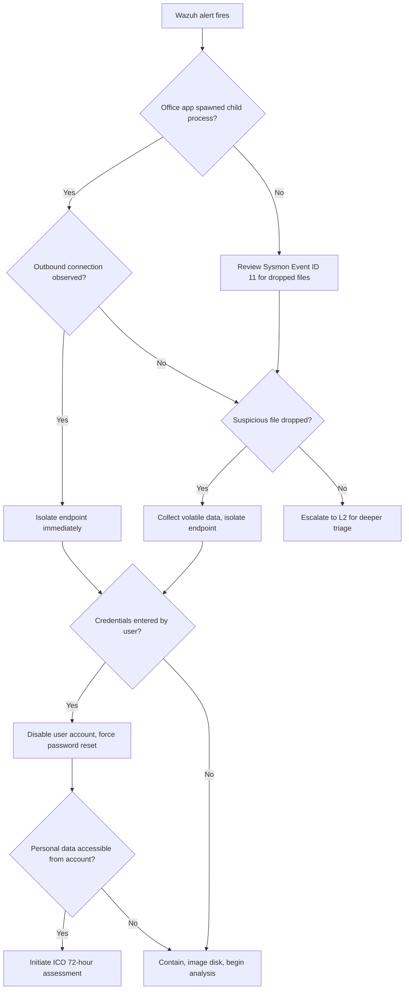

# Phishing Incident Response Playbook

- **Severity:** High
- **IOC Enrichment:** VirusTotal, AbuseIPDB
- **MITRE Techniques:** T1566.001 (Spearphishing Attachment), T1204.002 (Malicious File), T1078 (Valid Accounts)
- **ICO Notifiable:** Conditional - notify if credentials confirmed compromised or personal data accessed

---

## Detection Criteria

| Source | Rule / Event | Description |
|--------|-------------|-------------|
| Sysmon Event ID 1 | Process Create | Office application spawning cmd.exe, powershell.exe, wscript.exe, or mshta.exe |
| Sysmon Event ID 3 | Network Connect | Office process or mshta.exe initiating outbound connection |
| Wazuh Rule ? | Windows Defender alert | Malicious file detected on endpoint |
| Sysmon Event ID 11 | File Create | Suspicious file written to %TEMP%, %APPDATA%, or Downloads |
| Wazuh Rule 60106 | Windows Event Log | User account locked out after credential submission |

---

## Triage Questions

1. Which user account and endpoint triggered the alert?
2. Did an Office application or mshta.exe spawn a child process?
3. Is there outbound network activity from the suspicious process? If so, to which IP or domain?
4. Has the user account been used for any authentication events since the alert fired?
5. Are any other endpoints showing the same Sysmon Event ID 1 parent-child chain?

---

## Decision Tree



---

## Escalation Matrix

| Level | Trigger | Handover Requirement |
|-------|---------|----------------------|
| L1 | Alert received, initial triage | Log alert in TheHive, document triage questions |
| L2 | Child process confirmed or file dropped | TheHive case ID, Sysmon event chain, endpoint name |
| L3 | Active C2 connection or credential compromise | Full IOC list, affected accounts, network scope |
| CISO | Personal data accessed or ICO notification required | Written incident summary, legal and comms notified |

---

## ISO 27001 Lifecycle Phases

### Identification
Confirm the alert is a true positive. Review the Sysmon Event ID 1 process tree to establish the parent-child chain. Identify the triggering user account and endpoint.

```bash
# Wazuh -- query process creation events for the affected host
# Filter by agent.name and data.win.eventdata.parentImage containing WINWORD, EXCEL, or mshta
```

```kql
data.win.eventdata.parentImage: "*WINWORD*" AND data.win.system.eventID: "1"
```

Open a TheHive case. Set severity to High. Add the following as observables:
- Source email address
- Attachment filename and hash (MD5, SHA256)
- Child process name and full path
- Destination IP or domain from Sysmon Event ID 3

### Protection
Prevent further spread while analysis continues.

**Isolate the endpoint (Linux host running Wazuh):**
```bash
# Tag endpoint as isolated in Wazuh
curl -k -u admin:admin -X PUT "https://WAZUH_MANAGER:55000/active-response" \
  -H "Content-Type: application/json" \
  -d '{"command":"firewall-drop","arguments":["IP_ADDRESS"],"agent_list":["AGENT_ID"]}'
```

**Disable the user account (Active Directory):**
```powershell
Disable-ADAccount -Identity "username"
Set-ADUser -Identity "username" -Description "DISABLED: Phishing investigation $(Get-Date -Format yyyy-MM-dd)"
```

**Block identified IOCs at the network boundary** -- submit to firewall deny list if perimeter controls exist.

### Detection
Expand scope. Determine whether other endpoints received the same attachment or executed the same process chain.

```powershell
# Hunt for the same parent-child process chain across all Windows hosts
Get-WinEvent -ComputerName $targets -FilterHashtable @{
    LogName='Microsoft-Windows-Sysmon/Operational'
    Id=1
} | Where-Object { $_.Message -match "ParentImage.*WINWORD" } |
Select-Object TimeCreated, MachineName, Message
```

```powershell
# Hunt for the dropped file hash across endpoints
Get-ChildItem -Path C:\Users -Recurse -ErrorAction SilentlyContinue |
Get-FileHash -Algorithm SHA256 |
Where-Object { $_.Hash -eq "SHA256_HASH_HERE" }
```

Submit attachment hash to VirusTotal manually. Document the detection ratio and any identified malware family in the TheHive case.

Submit any destination IP to AbuseIPDB. Document confidence score and abuse category.

### Response
Contain the incident and collect evidence for analysis.

```bash
#!/bin/bash
# collect-evidence.sh
# Run on the isolated endpoint via Wazuh active response or direct SSH

CASE_ID="THive-XXXX"
HOST=$(hostname)
OUTPUT_DIR="/tmp/ir-$CASE_ID-$HOST"
mkdir -p "$OUTPUT_DIR"

# Running processes
ps aux > "$OUTPUT_DIR/processes.txt"

# Active network connections
ss -tulnp > "$OUTPUT_DIR/netstat.txt"

# Recently modified files in TEMP and APPDATA
find /tmp /home -newer /proc/1 -type f 2>/dev/null > "$OUTPUT_DIR/recent-files.txt"

# Sysmon Event ID 1 and 3 from last 2 hours (Windows -- run equivalent via PowerShell)
echo "Collect Sysmon XML from Windows Event Viewer for Event IDs 1 and 3" >> "$OUTPUT_DIR/notes.txt"

tar -czf "/tmp/evidence-$CASE_ID.tar.gz" "$OUTPUT_DIR"
echo "Evidence collected: /tmp/evidence-$CASE_ID.tar.gz"
```

```powershell
# Windows volatile collection
$CaseID = "THive-XXXX"
$Output = "C:\IR\$CaseID"
New-Item -ItemType Directory -Path $Output -Force

Get-Process | Export-Csv "$Output\processes.csv" -NoTypeInformation
Get-NetTCPConnection | Export-Csv "$Output\connections.csv" -NoTypeInformation
Get-WinEvent -FilterHashtable @{LogName='Microsoft-Windows-Sysmon/Operational'; Id=1,3} |
    Export-Csv "$Output\sysmon-events.csv" -NoTypeInformation

# Hash all files in user's Downloads and TEMP
Get-ChildItem "$env:USERPROFILE\Downloads","$env:TEMP" -Recurse -ErrorAction SilentlyContinue |
    Get-FileHash -Algorithm SHA256 | Export-Csv "$Output\file-hashes.csv" -NoTypeInformation
```

If credentials were submitted to a phishing page:
- Force password reset for the compromised account
- Revoke any active sessions (Azure AD / on-prem as applicable)
- Check authentication logs for logins from unexpected IPs or at unusual times

### Recovery
Before returning the endpoint to production, validate the following:

**Recovery Validation Checklist**

- [ ] Malicious file removed or endpoint reimaged
- [ ] No persistence mechanisms present (Run keys, scheduled tasks, services)
- [ ] User account re-enabled with new credentials
- [ ] Multi-factor authentication confirmed active on account
- [ ] Wazuh agent reporting normally from endpoint
- [ ] No further suspicious process creation events in last 24 hours
- [ ] IOCs added to block list (firewall, DNS, proxy where applicable)
- [ ] TheHive case updated with resolution notes

```powershell
# Verify no persistence in Run keys
Get-ItemProperty "HKCU:\Software\Microsoft\Windows\CurrentVersion\Run"
Get-ItemProperty "HKLM:\Software\Microsoft\Windows\CurrentVersion\Run"

# Verify no unexpected scheduled tasks
Get-ScheduledTask | Where-Object { $_.TaskPath -notlike "\Microsoft\*" } |
    Select-Object TaskName, TaskPath, State
```

---

## UK GDPR / ICO Tripwires

| Condition | Action |
|-----------|--------|
| User entered credentials on phishing page | Assess what data the account had access to within 24 hours |
| Account used to access personal data after compromise | 72-hour ICO notification clock starts from time of confirmed access |
| Bulk mailout from compromised account | Treat as potential data breach, assess recipient data |
| No confirmed data access | Document risk assessment and decision not to notify; retain records |

**ICO notification threshold:** A personal data breach is notifiable if it is likely to result in a risk to the rights and freedoms of individuals. Credential compromise alone may not meet this threshold if access logs confirm no personal data was reached. Document the risk assessment either way.

---

## Known Detection Gaps

| Gap | Impact | Remediation |
|-----|--------|-------------|
| Phishing email delivery not visible in Wazuh | Cannot detect the initial lure without mail gateway integration | Integrate mail gateway logs or Microsoft 365 Defender alerts into Wazuh |
| Browser-based credential submission not logged | Credential theft via fake login page leaves no Sysmon artefact | DNS logging or proxy logs required to correlate with phishing domain |
| HTML smuggling payloads | Attachment may not trigger Sysmon Event ID 11 if payload assembled in memory | Memory analysis or EDR with process injection detection required |

---

## TheHive IOC Template

```json
{
  "title": "Phishing - [HOSTNAME] - [DATE]",
  "severity": 2,
  "tags": ["phishing", "T1566.001", "T1204.002"],
  "observables": [
    { "dataType": "filename", "data": "malicious_attachment.docm", "tags": ["attachment"] },
    { "dataType": "hash", "data": "SHA256_HASH", "tags": ["malware", "virustotal"] },
    { "dataType": "domain", "data": "phishing-domain.com", "tags": ["c2", "abuseipdb"] },
    { "dataType": "ip", "data": "1.2.3.4", "tags": ["c2", "abuseipdb"] },
    { "dataType": "mail", "data": "sender@domain.com", "tags": ["sender"] },
    { "dataType": "user-account", "data": "DOMAIN\\username", "tags": ["affected-account"] }
  ]
}
```

---

## Real-World Reference

**NHS WannaCry (2017)** -- Although primarily a ransomware incident, the initial infection vector involved exploitation following phishing delivery. The NAO post-incident report highlighted that 81 NHS trusts were affected, and that basic controls including patching and network segmentation were absent. The incident resulted in over 19,000 cancelled appointments and cost the NHS an estimated 92 million pounds. The ICO did not fine the NHS given it was the victim, but the case established that inadequate preventative controls are a factor in regulatory assessment.

Source: [NAO Investigation into WannaCry (2018)](https://www.nao.org.uk/reports/investigation-wannacry-cyber-attack-and-the-nhs/)
